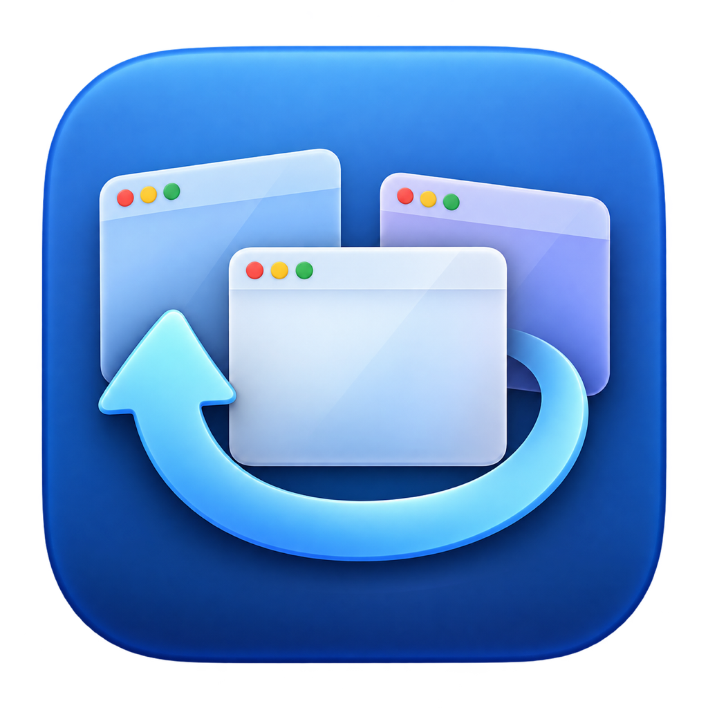

# Electro Magnet

Remember and restore window layouts across monitors and macOS desktop Spaces.

Electro Magnet is a lightweight native menu-bar utility. Arrange your existing windows with Magnet or another window arranger, remember a named layout, and restore it when macOS moves or resizes the windows.

**Nothing moves automatically.** No tiling, snapping, competing global shortcuts, closed-app launching, document reopening or browser-tab restoration. Existing browser tabs and logged-in sessions stay open.

## Download

[Download the Apple Silicon development preview](https://github.com/sagegodspeed/electro-magnet/releases/download/v0.1.2-preview/Electro-Magnet-0.1.2-preview-arm64.zip) · [Release notes](https://github.com/sagegodspeed/electro-magnet/releases/tag/v0.1.2-preview)

The preview is ad-hoc signed and **not notarized**. Gatekeeper may block a downloaded copy. A Developer ID–signed, notarized release is pending; building from source is the developer route today. Tested on macOS 27 / Apple Silicon. See [compatibility and distribution](docs/COMPATIBILITY.md).

## Use

1. Enable Electro Magnet in **System Settings → Privacy & Security → Accessibility** (called **Device Control & Data Access** on macOS 27). The app's setup button opens the permission pane.
2. Arrange the existing windows across your monitors and desktop Spaces.
3. Choose **Remember Layout…** from the menu bar and give the layout a name. Review Last Result for anything that could not be remembered.
4. When the arrangement changes, select the layout → **Restore** and review restored, adjusted or skipped windows.

Each layout supports **Overwrite with Current Layout**, **Rename** and **Delete**. Layouts persist across app restarts. Restore does not overwrite saved destinations.

## Behavior and limits

- Displays are matched by UUID, not enumeration order.
- Missing displays or Spaces use an available destination and retain the saved assignment for a later Restore.
- If a saved Space identity disappears, Restore uses its saved desktop position on the original monitor when that position still exists. Surviving Space identities take priority over desktop order. This is reported as adjusted; desktop positions can refer to different Spaces after manual reordering.
- Windows require reliable identity matches; ambiguous matches and missing/unsupported windows are skipped.
- After an application relaunch, Chrome/Edge profile labels and recognized mail/Teams account labels help match changed titles. Browser tab labels can distinguish windows in the same profile. Duplicate matches remain skipped; Last Result gives the reason.
- Native fullscreen, minimized, hidden-app, panel and all-desktop windows are excluded.
- Usable screen bounds and application minimum sizes are respected; read-back checks actual geometry and Space assignment.
- Some inactive-Space browser windows require visiting their Space once after starting the utility. Last Result reports omissions.
- Space restoration and parts of window discovery use private macOS APIs. Compatibility can change after macOS updates. No SIP changes or privileged helpers are required.

## Build

Install Xcode or the Swift command-line tools and complete their required setup/license steps, then run:

```sh
zsh Tools/build-app.sh
open "dist/Electro Magnet.app"
```

Copy the app to a stable local Applications folder before granting Accessibility permission. The default build is ad-hoc signed; rebuilding may require renewing its own permission entry.

```sh
zsh Tools/test.sh
```

See [testing](docs/TESTING.md) for recorded results and remaining physical acceptance checks. No package dependencies are required.

## Privacy

Layouts are stored locally in `~/Library/Application Support/ElectroMagnet/layouts.json`. They can contain window titles, document identifiers, application identifiers, account hints from browser tab labels, bounds and monitor/Space destinations. Tab inspection reads browser controls only, skips webpage content and never selects a tab. The app has no accounts, analytics, cloud sync, ads or network data transmission. Accessibility permission is used for inspecting windows and explicitly requested Restore actions.

Saved user layouts, raw machine-specific test evidence and credentials are excluded from the public repository.

## Credits and license

The Space-move approach was informed by [WindowKit](https://github.com/ejbills/WindowKit/blob/main/Sources/WindowKit/SystemBridge/SkyLightSpace.swift) and [DockDoor](https://github.com/ejbills/DockDoor/blob/main/DockDoor/Utilities/PrivateApis.swift). [Hammerspoon documents the limitations of private Space APIs](https://www.hammerspoon.org/docs/hs.spaces.html).

The original icon artwork and its generation prompt are in [Assets/AppIcon](Assets/AppIcon). Electro Magnet is an independent project and is not affiliated with Magnet or Apple.

[MIT License](LICENSE).
